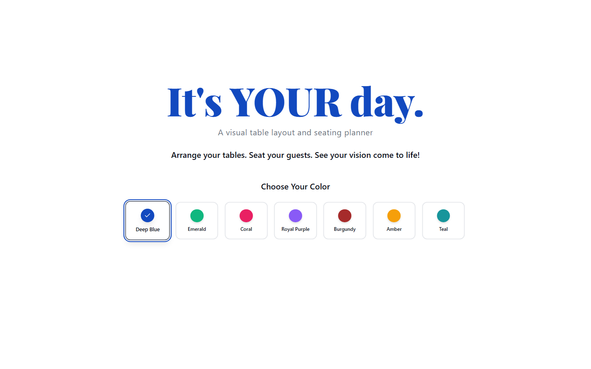
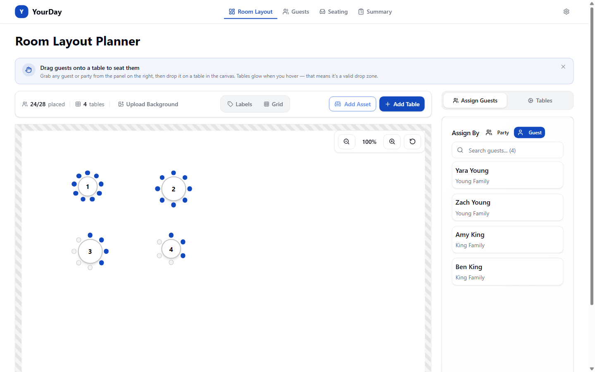
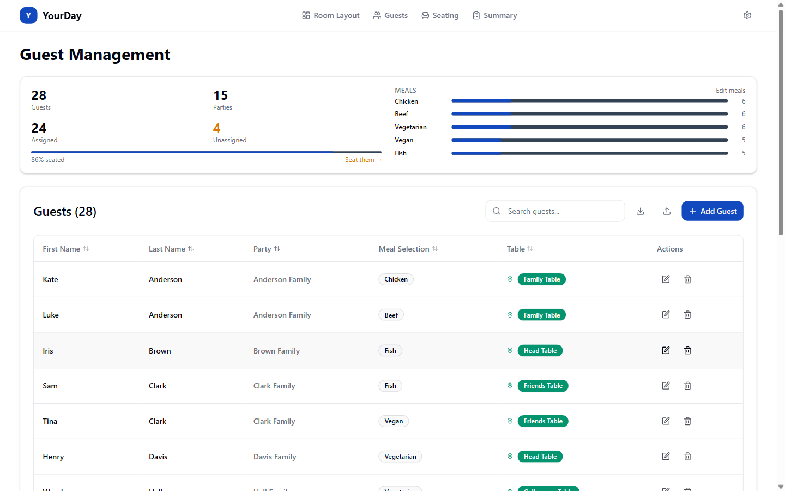
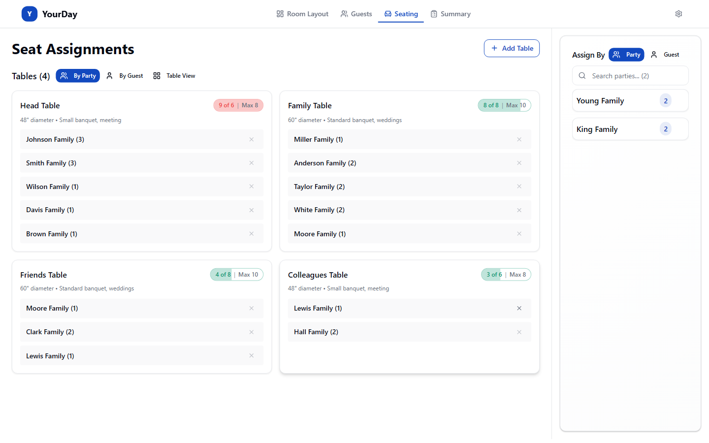

# YourDay — Table & Seating Planner

A visual event planner for designing venue floor plans, placing tables, managing guest lists, and assigning seating — built for weddings, galas, corporate events, and any occasion where every seat matters.

100% client-side. No accounts. No backend. Your data lives in your browser.

**➡️ [Try it live](https://your-day-demo.example.com)** &nbsp;·&nbsp; or run locally with `npm install && npm run dev` (instructions below).



## Features

**Room Layout Designer** — Drag-and-drop canvas for placing round and rectangular tables, drawing room borders, and uploading venue floor plans as overlays.



**Guest Management** — Import guest lists from CSV or Excel, track meal selections and dietary needs, organize guests into parties/families, and search/filter across large lists.



**Seat Assignments** — Assign guests and parties to tables with real-time capacity tracking. Drag guests between tables or use the assignment panel.



**Banquet Summary** — Export-ready reports with table assignments, meal counts, and dietary breakdowns for your catering team.

**Color Themes** — Choose from 7 color palettes (Deep Blue, Emerald, Coral, Royal Purple, Burgundy, Amber, Teal) that style the entire app.

**Demo Mode** — Try the full app instantly with sample data — no account required.

## Tech Stack

| Layer          | Technology                                                               |
| -------------- | ------------------------------------------------------------------------ |
| Frontend       | React 19, TypeScript, Vite 8 (rolldown + oxc), Tailwind CSS 4, shadcn/ui |
| Routing        | React Router DOM 7                                                       |
| Validation     | Zod 4                                                                    |
| Testing        | Vitest 4, Testing Library, Playwright                                    |
| File parsing   | papaparse (CSV), exceljs (Excel)                                         |
| Virtualization | @tanstack/react-virtual                                                  |

## Getting Started

### Prerequisites

- Node.js 20+
- npm

### Install & Run

```bash
git clone https://github.com/kyle-giacchi/yourday-table-seating-planner.git
cd yourday-table-seating-planner
npm install
npm run dev
# Open http://localhost:8080
```

The app runs entirely in the browser using `localStorage`. No backend, no environment variables, no setup required.

### Build for production

```bash
npm run build
# Output → dist/
```

The built artifact is a static site that can be hosted on any CDN — Cloudflare Pages, Netlify, Vercel, GitHub Pages, S3, etc.

## Scripts

| Command                 | Description                            |
| ----------------------- | -------------------------------------- |
| `npm run dev`           | Dev server on port 8080                |
| `npm run build`         | Production build                       |
| `npm run preview`       | Preview the production build locally   |
| `npm run test`          | Frontend tests (Vitest, ~330 tests)    |
| `npm run test:coverage` | Run tests with V8 coverage             |
| `npm run test:e2e`      | Playwright end-to-end tests            |
| `npm run lint`          | ESLint                                 |
| `npm run format`        | Prettier (write)                       |
| `npm run format:check`  | Prettier (check, used in CI)           |
| `npm run typecheck`     | TypeScript check (`tsconfig.app.json`) |

## Project Structure

```
src/
├── components/        # UI components (banquet, guest, navigation, room-setup, seating, table-view, ui)
├── contexts/          # React Context providers
├── hooks/             # Custom hooks (useSeating, useTableAssignment, etc.)
├── lib/               # Utilities (security, capacity, image, file parsing)
├── pages/             # Route pages (Index, SeatingManager, GuestManagement, ...)
├── schemas/           # Zod validation schemas
├── types/             # TypeScript type definitions
├── services/          # DataRepository (localStorage persistence)
└── utils/             # Helpers (drag, export, summary view-models)
public/
├── _headers           # CSP and cache-control headers (Cloudflare Pages format)
├── fonts/             # Self-hosted Playfair Display
└── og-image.jpg       # Open Graph preview
```

## Architecture

The app uses a layered React Context architecture. All persistence is `localStorage` via `DataRepository`. There is no backend, no auth, and no payment integration in the codebase — earlier versions had a Cloudflare Workers backend; it was removed when the app went standalone. Git history preserves it for anyone who wants to fork a hosted version.

See [docs/architecture.md](docs/architecture.md) for the full data flow, context hierarchy, and state management details.

## Documentation

| Document                                 | Contents                                                |
| ---------------------------------------- | ------------------------------------------------------- |
| [Invariants](docs/invariants.md)         | Non-obvious brittle integration points — read first     |
| [Architecture](docs/architecture.md)     | Context hierarchy, data flow, state management          |
| [Components](docs/components.md)         | Component catalog and file paths                        |
| [Styling Guide](docs/styling-guide.md)   | Color tokens, typography, design conventions            |
| [Seating Canvas](docs/seating-canvas.md) | Canvas layering rules                                   |
| [Room Assets](docs/room-assets.md)       | Room assets feature internals                           |
| [Theme System](docs/theme-system.md)     | Color theme pipeline                                    |

For project context aimed at AI coding agents, see [CLAUDE.md](CLAUDE.md).

## Contributing

Pull requests are welcome. Please read [CONTRIBUTING.md](CONTRIBUTING.md) for development workflow, coding conventions, and the CI gates that block merges.

## Security

If you discover a security vulnerability, please follow the process in [SECURITY.md](SECURITY.md). **Do not open a public issue.**

## License

[MIT](LICENSE) — Copyright © 2026 Kyle Giacchi

---

<sub>Built by [Kyle Giacchi](https://www.linkedin.com/in/kylegiacchi/) — connect on LinkedIn if you end up using YourDay for your big day.</sub>
